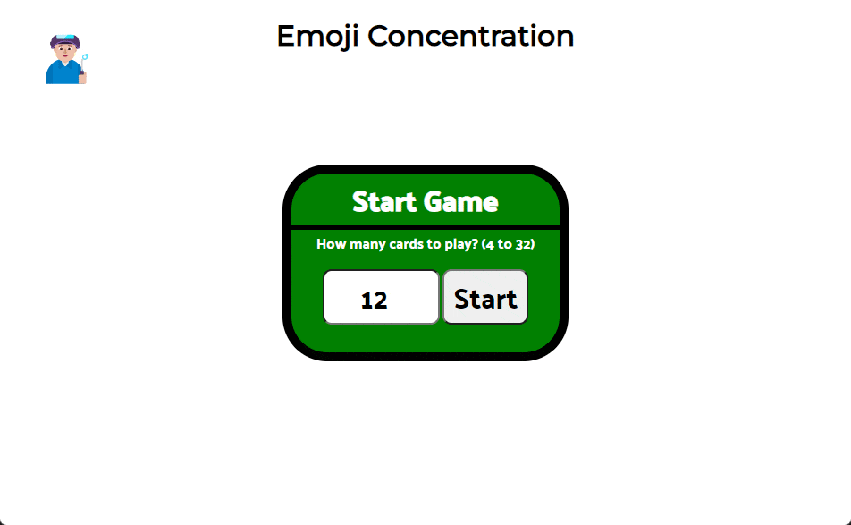

# Milestone Project 1

[Link](https://sagreenxyz.github.io/ksu-sdb-milestone-project-1/) to hosted game.

## Background
This milestone project is an effort to show skills that have been learned from the first section of our development bootcamp program.  This first section taught skills in HTML, CSS, JavaScript and UI/UX.  The objective was to create a game.  In this case, my game is concentration - where a table of cards are placed face down.  The user must click cards to match pairs until the remain no unmatched cards.  This must be accomplished within the time limit (3 minutes) to win the game.

## Blocks

## Ideas for Improvement
