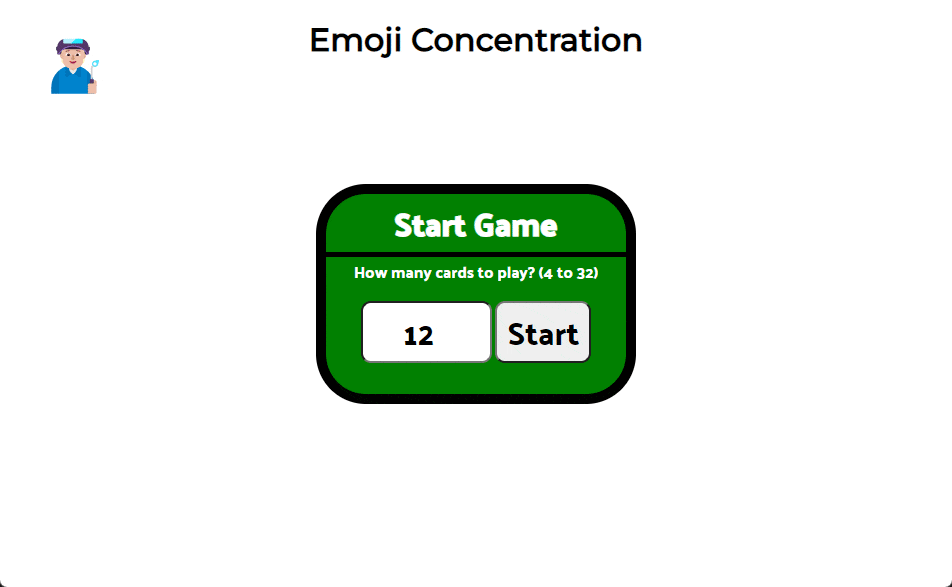

# Milestone Project 1



[Link](https://sagreenxyz.github.io/ksu-sdb-milestone-project-1/) to hosted game.

## Background
This milestone project is an effort to show skills that have been learned from the first section of our development bootcamp program.  This first section taught skills in HTML, CSS, JavaScript and UI/UX.  The objective was to create a game.  In this case, my game is concentration - where a table of cards are placed face down.  The user must click cards to match pairs until the remain no unmatched cards.  This must be accomplished within the time limit (3 minutes) to win the game.

## A Block - Comparing Emojis
My original intent was to simply compare emojis like any text character.  I soon found emojis were matching that did not look the same!  Emojis are unicode characters and composed of one or more codepoints - a base code with zero or more modifiers.  Whatsmore, some sets of codepoint combinations produce the exact same emoji character.  To resolve this, I added logic around the emojis array to produce a unique identifier.  Instead of choosing emojis from ```['🙀', '👩‍🏭', '🥻', '👲🏻', '✍🏼']```, the list is converted to: ```[[0, '🙀'], [1, '👩‍🏭'], [2, '🥻'], [3, '👲🏻'], [4, '✍🏼']]```.  The integer before the emoji would then be used in the comparisons.  If a card with a ```data-emojiid``` value of 3 was compared to another with a ```data-emojiid``` of 3, the match would occur whereas a "3" versus a "4" would not.

## Other Areas of Learning

### ```node.classList.add()``` and ```node.classList.remove()```
The use of CSS is greatly simplified through the use of classes.  A style can be applied to and removed from the HTML element through the use of JavaScript ```node.classList.add()``` for adding the style and then ```node.classList.remove()``` for removal.  For example, a blinking border CSS style was created and named, ```.blinking-border{}```.  At the right place within the JavaScript logic, it was added to a div (for example, let's call this div, "card") using the following code example:

```document.getElementById('card-1').classList.add('.blinking-border');```

Later (after the duration of a ```timeOut()``` has occurred), the blinking can be stopped with the following:

```document.getElementById('card-1').classList.remove('.blinking-border');```

### ```Event.currentTarget```

The ```currentTarget``` return value for an event listener can be passed to functions for further processing.

```javascript
card.addEventListener('click', e => {
    handleCardClick(e.currentTarget);
});
```

For instance, the event listener in this example was attached to a card element.  That card needed to be either hidden or its background color changed, depending on logic circumstances.  However, rather than build that code into the event listener declaration, a separate function was created and the element current target passed as a parameter.

```clearInterval()``` and ```clearTimeout()```

In a few strategic locations, timers and intervals were cleared to prevent their callback functions from being called at a later time.  For instance, the game would run for a specific duration after which time if the player did not complete the puzzle, an event would occur to stop the game and display an "out of time" modal.  The code for displaying that modal would be sent as a callback inside a ```timeOut()``` command.  However, if the player won (completed the game in time), the ```timeOut()``` would need to be cleared.  To do so, code such as the following was used:

```javascript
let objInterval;
let objSetTimeoutControl;
//........
objSetTimeoutControl = setTimeout(() => {
    document.getElementById('timer-control').classList.add('blinking-warning-background')
}, warningStartTimeMS);
//........
objInterval = setInterval(() => {
    if ((Date.now() - startTime) >= gameDurationLimitMS) {
        hideDivTimerControl();
        document.getElementById('timer-control').classList.remove('blinking-warning-background')
        showModalTimeout();
    }
    document.getElementById('timer').innerText = `Time Remaining: ${new Date(gameDurationLimitMS - (Date.now() - startTime)).toISOString().slice(14, 19)}`;
}, 1000);
//........
function hideDivTimerControl() {
    document.getElementById('timer-control').style.visibility = 'hidden';
    clearTimeout(objSetTimeoutControl); // example
}
//........
function showModalSuccess() {
    document.querySelector('main').style.opacity = '0.3';
    document.getElementById('modalSuccess').style.display = 'block';
    document.getElementById('modalSuccess').style.visibility = 'visible';
    clearInterval(objInterval);  // example
    clearTimeout(objSetTimeoutControl);  // example
    setTimeout(() => {
        hideModalSuccess();
        showModalStartGame();
    }, 4000);
}
```

### How To Shuffle an Array?
Algorithms for shuffling already exist.  Through an Internet search, I was able to locate the Fisher-Yates algorhythm.  Further research found an improved form, known as the "Durstenfeld" shuffle algorhythm.  The following function was created from examples on the Internet:

```javascript
function shuffleArray(array) {
    // Durstenfeld shuffle algorhythm optimization of Fisher-Yates shuffle algorhythm\
    // Attribution:  Accessed on 2022-02-04 at https://www.thiscodeworks.com/durstenfeld-shuffle-algorithm-optimized-fisher-yates-javascript-vanilla-sort-randomize-array/60cd9c0b0c21d80014540536
    for (let i = array.length - 1; i > 0; i--) {
        const j = Math.floor(Math.random() * (i + 1));
        [array[i], array[j]] = [array[j], array[i]];
    }
    return array;
}
```

### How to Remove All Child Nodes?
There seems to be no native way in JavaScript to remove all child nodes of a parent with one command.  The ```.append()```, ```.appendChild()``` and ```.removeChild()``` methods exist, but there is no corresponding ```.removeAllChildren()```.  From an Internet search, I was able to find the following:

```javascript
function removeAllChildren(parentNode){
    /// Attribution:  Accessed on 2022-02-03 at https://www.javascripttutorial.net/dom/manipulating/remove-all-child-nodes/
    while(parentNode.firstChild) {
        parentNode.removeChild(parentNode.firstChild);
    }
}
```

## Ideas for Improvement

### Static Header
When the screen becomes vertically scrollable, the header will scroll upwards with the page.  This seems to be undesireable and a simple CSS change.

### Emoji Center Vertically on Cards
The emojis are currently towards the top of each card.  Again, with a simple CSS change, this can be improved aesthetically.